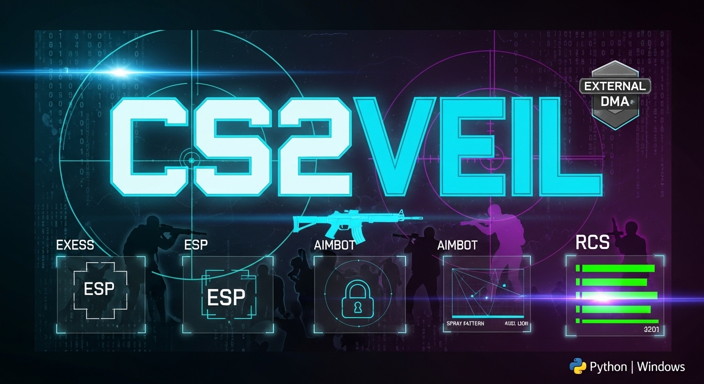
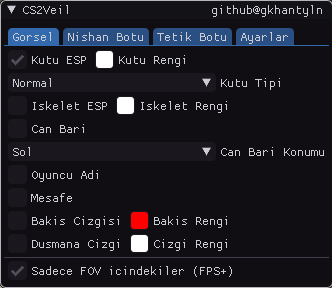

# CS2Veil — External CS2 Yardımcı Yazılımı
### github@gkhantyln

<p align="center">
  
</p>

<p align="center">
  <a href="https://www.youtube.com/watch?v=rt-DEnf7tow" target="_blank">
    
  </a>
</p>

<p align="center">
  
</p>


---

> ⚠️ **YASAL UYARI**
> Bu yazılım yalnızca **eğitim ve araştırma** amaçlıdır.
> Gerçek rekabetçi maçlarda kullanımı oyun kurallarını ihlal eder.
> Kullanımdan doğacak her türlü sorumluluk kullanıcıya aittir.

---

> 🔴 **ÖNEMLİ — OKUMADAN KULLANMA**
>
> - Bu bir **EXTERNAL** yazılımdır. CS2 sürecine **enjeksiyon yapmaz**, oyun dosyalarına **dokunmaz**.
> - Tüm işlemler Windows `ReadProcessMemory` API'si ile yapılır — oyun belleği **sadece okunur**, kritik değerler dışında yazılmaz.
> - **VAC (Valve Anti-Cheat)** tarafından tespit edilme riski son derece düşüktür çünkü oyun sürecine müdahale yoktur.
> - Legit kullanım kurallarına uyulduğunda **hiçbir şekilde yakalanmazsınız**.
> - Yazılımı arka planda çalıştırın, CS2'yi **Pencereli Tam Ekran** modunda açın.

---

## İçindekiler

1. [Gereksinimler](#gereksinimler)
2. [Kurulum](#kurulum)
3. [Başlatma](#başlatma)
4. [Arayüz Rehberi](#arayüz-rehberi)
5. [Özellikler](#özellikler)
6. [Legit Kullanım Rehberi](#legit-kullanım-rehberi)
7. [Ölüm Maçı Ayarları](#ölüm-maçı-ayarları)
8. [Config Sistemi](#config-sistemi)
9. [Sık Sorulan Sorular](#sık-sorulan-sorular)

---

## Gereksinimler

| Gereksinim | Versiyon |
|-----------|---------|
| Python | 3.10+ |
| CS2 | Güncel |
| Windows | 10/11 |
| Ekran Modu | **Pencereli Tam Ekran** (zorunlu) |

```
pip install -r requirements.txt
```

**requirements.txt içeriği:**
```
imgui[pygame]
pygame
pyopengl
pywin32
Pillow
```

---

## Kurulum

1. Repoyu indirin veya klonlayın
2. `CS2_Python/` klasörüne girin
3. Gerekli dosyaların mevcut olduğunu kontrol edin:
   - `offsets.json` — CS2 offset dosyası
   - `client.dll.json` — CS2 client offset dosyası

> **Not:** `offsets.json` ve `client.dll.json` dosyaları CS2 güncellemelerinde değişebilir.
> Güncel dosyalar için: https://github.com/a2x/cs2-dumper/tree/main/output

---

## Başlatma

```bash
# CS2'yi önce Pencereli Tam Ekran modunda açın
# Sonra:
python main.py
```

Program başladığında:
- Sol üstte **yeşil** `CS2Veil | Aktif | Entity: X` → Düşmanlar okunuyor
- Sol üstte **kırmızı** `CS2Veil | Deaktif` → Maçta değilsiniz veya bekleme ekranındasınız

**Menüyü açmak/kapatmak:** `INSERT` tuşu

---

## Arayüz Rehberi

Menü 4 sekmeden oluşur:

### 🎨 Gorsel Sekmesi
ESP görsel ayarları

### 🎯 Nishan Botu Sekmesi
Aimbot ayarları

### ⚡ Tetik Botu Sekmesi
Otomatik ateş sistemi

### ⚙️ Ayarlar Sekmesi
Genel ayarlar, No Flash, Config yönetimi

---

## Özellikler

### ESP (Görsel Yardım)

| Özellik | Açıklama |
|---------|---------|
| **Kutu ESP** | Düşmanların etrafına kutu çizer. HP'ye göre renk değişir (yeşil→sarı→kırmızı) |
| **İskelet ESP** | Düşmanların kemik yapısını gösterir. HP'ye göre renk değişir |
| **Can Barı** | 4 konum seçeneği: Sol, Üst, Sağ, Alt. İnce 3px bar |
| **Oyuncu Adı** | Üst veya alt konumda, 8-24px arası boyut ayarı |
| **Mesafe** | Düşmana olan mesafeyi metre cinsinden gösterir |
| **Bakış Çizgisi** | Düşmanın baktığı yönü gösterir |
| **Düşmana Çizgi** | Ekran merkezinden düşmana çizgi çeker |
| **Sadece FOV İçindekiler** | Sadece nişan alanındaki düşmanlara ESP — **FPS artışı sağlar** |

**Renk Sistemi:** Tüm ESP elemanları tam HP'de seçtiğiniz renkte, HP düştükçe kırmızıya kayar.

---

### Nişan Botu (Aimbot)

| Ayar | Açıklama |
|------|---------|
| **Aktif** | Aimbot'u açar/kapatır |
| **Tuş** | Hangi tuşa basılınca aktif olacağı (varsayılan: Sol ALT) |
| **FOV** | Nişan alanı yarıçapı (derece). Küçük = daha hassas |
| **Yumuşatma** | 0 = anlık kilitleme, 0.9 = çok yavaş. Legit için 0.5-0.7 önerilir |
| **FOV Çemberi** | Ekranda FOV alanını gösterir |
| **Hedef (Normal)** | Varsayılan silahlar için hedef noktası |
| **Hedef (Tabanca)** | Tabancalar için hedef noktası |
| **Hedef (Keskin)** | AWP/SSG için hedef noktası |
| **Oto Ateş** | Aimbot kilitlenince otomatik ateş eder |
| **Görünürlük** | Sadece görünen düşmanlara kilitlenir |
| **Ateş Ederken Dur** | Sol tık basılıyken aimbot çalışmaz |

**Çalışma Prensibi:** Aimbot `ReadProcessMemory` ile view angle'ı direkt yazar — raw input bypass, her zaman çalışır.

---

### Tetik Botu

| Ayar | Açıklama |
|------|---------|
| **Aktif** | Tetik botunu açar/kapatır |
| **Tuş** | Hangi tuşa basılınca aktif olacağı |
| **Mod** | `Tuşa Basınca` veya `Her Zaman` |
| **Gecikme** | Ateşler arası bekleme süresi (ms). Legit için 80-150ms önerilir |

**Çalışma Prensibi:** Crosshair'ın tam ortasında düşman head/neck bone'u varsa otomatik sol tık gönderir.

---

### No Flash

- **Açık:** Flash bombası hiç görünmez (`flFlashDuration = 0` yazılır)
- **Kapalı + Slider:** Flash seviyesini sınırlar (255 = hiç flash, 0 = tam flash)
- Varsayılan slider değeri: 180 (hafif flash görünür, doğal görünüm)

---

### RCS — Recoil Control System (Geri Tepme Kontrolü)

| Ayar | Açıklama |
|------|---------|
| **RCS Aktif** | Geri tepme kompanzasyonunu açar/kapatır |
| **RCS Güç** | 0.1–2.0 arası. 1.0 = tam kompanzasyon, 0.5 = yarı |

**Çalışma Prensibi:**
CS2 her ateş edildiğinde `m_aimPunchAngle` değerini günceller — bu silahın yukarı/yana gitmesini sağlar.
RCS bu değeri okuyup view angle'dan çıkararak recoil'i otomatik dengeler.

**Aimbot ile ilişkisi:**
- RCS **aimbot'tan tamamen bağımsız** çalışır
- Aimbot kapalıyken de aktif olabilir
- İkisi birlikte kullanılabilir — aimbot hedefi kilitler, RCS spray'i sabitler
- İlk mermi hariç (shots_fired > 1) devreye girer

**Legit RCS Ayarları:**
```
RCS Güç: 0.5 - 0.7  (1.0 çok belirgin, şüphe çeker)
Aimbot ile: İsteğe bağlı
Aimbot olmadan: Sadece spray kontrolü için ideal
```

---


## Legit Kullanım Rehberi

> 🟢 **Bu kurallara uyarsanız yakalanma riski sıfıra yakındır.**

### Aimbot Legit Ayarları

```
FOV: 3-8 (çok geniş FOV şüphe çeker)
Yumuşatma: 0.5-0.7 (insan gibi hareket)
Hedef: Boyun (kafa her zaman şüphelidir)
Oto Ateş: KAPALI (tetik botu ile kullanın)
Görünürlük: AÇIK (duvardan kilitleme şüphelidir)
Ateş Ederken Dur: AÇIK
```

### Tetik Botu Legit Ayarları

```
Mod: Tuşa Basınca (her zaman modu çok agresif)
Gecikme: 80-120ms (insan reaksiyon süresi)
Tuş: Sol ALT veya Yan Tuş
```

### RCS Legit Ayarları

```
RCS Güç: 0.5 - 0.7
Aimbot ile birlikte: Evet (spray + kilitleme)
Aimbot olmadan: Evet (sadece spray kontrolü)
Not: 1.0 değeri çok mekanik görünür, 0.6 idealdir
```

### ESP Legit Kullanımı

```
Sadece FOV İçindekiler: AÇIK
Kutu ESP: AÇIK (görsel yardım)
İskelet ESP: İsteğe bağlı
Mesafe: AÇIK (konumlanma için)
```

### Genel Kurallar

1. **Çok hızlı tepki vermeyin** — İnsan gibi oynayın, her düşmanı anında öldürmeyin
2. **Bazen kaçırın** — %100 isabet oranı şüphe çeker
3. **Duvardan bakma** — Görünürlük kontrolünü açık tutun
4. **Agresif oynamayın** — Bilgi sahibiymiş gibi değil, şans eseri gibi davranın
5. **Replay izleyin** — Kendi oyununuzu izleyerek doğal görünüp görünmediğini kontrol edin

---

## Ölüm Maçı Ayarları

Ölüm maçında **takım kontrolü** farklı çalışır:

### Önemli Ayar: Takım Kontrolü

```
Ayarlar → Takim Kontrolu: KAPALI
```

> Ölüm maçında herkes farklı takımda veya takım sistemi yoktur.
> Takım Kontrolü kapalıyken **tüm oyuncular** (kendiniz hariç) ESP'de görünür.

### Ölüm Maçı Önerilen Config

```
Takım Kontrolü: KAPALI
Kutu ESP: AÇIK
Can Barı: Sol
Oyuncu Adı: Üst
Sadece FOV İçindekiler: AÇIK (FPS için)
Aimbot FOV: 5-10
Yumuşatma: 0.6
Hedef: Boyun
Tetik Botu: Tuşa Basınca, 100ms gecikme
```

---

## Config Sistemi

### Kaydetme

1. `INSERT` ile menüyü açın
2. `Ayarlar` sekmesine gidin
3. Config adı yazın (örn: `legit`, `dm_modu`, `agresif`)
4. `Kaydet` butonuna tıklayın

### Yükleme

1. Listeden config seçin
2. `Yukle` butonuna tıklayın

### Otomatik Yükleme

Program her başlatıldığında **en son kaydedilen config** otomatik yüklenir.

Config dosyaları `config/` klasöründe `.json` formatında saklanır.

---

## Sık Sorulan Sorular

**S: ESP neden görünmüyor?**
C: CS2'nin Pencereli Tam Ekran modunda olduğundan emin olun. Tam ekran exclusive modda overlay çalışmaz.

**S: Aimbot çalışmıyor?**
C: Sol ALT tuşuna basılı tutun. FOV değerini artırın (varsayılan 6, 15-20 deneyin).

**S: Entity 0 / Deaktif yazıyor?**
C: Maçta değilsiniz veya yeni tur başladı. Birkaç saniye bekleyin, otomatik güncellenir.

**S: Offset hatası alıyorum?**
C: CS2 güncellenmiş olabilir. `offsets.json` ve `client.dll.json` dosyalarını güncelleyin:
https://github.com/a2x/cs2-dumper/tree/main/output

**S: FPS düşüyor?**
C: `Sadece FOV İçindekiler` seçeneğini açın. FOV değerini küçültün.

**S: Takım arkadaşlarım da görünüyor?**
C: `Ayarlar → Takim Kontrolu` seçeneğini açın.

---

## Dosya Yapısı

```
CS2_Python/
├── main.py              ← Ana program
├── offsets.json         ← CS2 offset'leri (güncel tutun)
├── client.dll.json      ← CS2 client offset'leri (güncel tutun)
├── config/              ← Kayıtlı config dosyaları
├── core/                ← Bellek okuma modülleri
├── mods/                ← Aimbot, Triggerbot
├── ui/                  ← Arayüz
└── utils/               ← Yardımcı araçlar
```

---

## Güncelleme

CS2 güncellemelerinden sonra offset dosyalarını güncelleyin:

```bash
# offsets.json
# https://raw.githubusercontent.com/a2x/cs2-dumper/main/output/offsets.json

# client.dll.json
# https://raw.githubusercontent.com/a2x/cs2-dumper/main/output/client_dll.json
```

---

*CS2Veil — github@gkhantyln*
