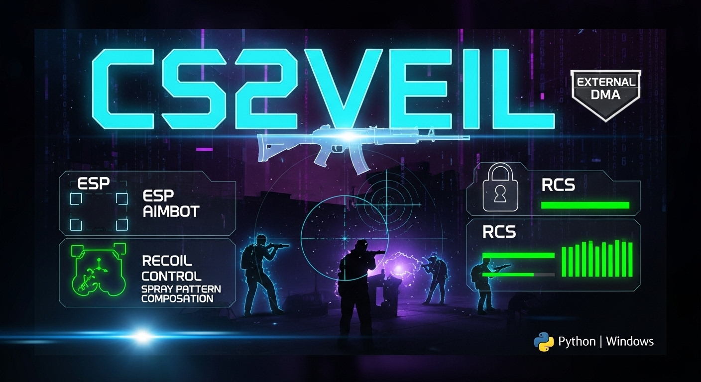
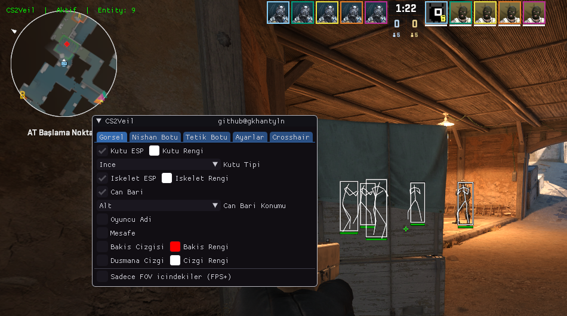

# CS2Veil — External CS2 Yardımcı Yazılımı
### github@gkhantyln

<p align="center">
  
</p>

<p align="center">
  <a href="https://www.youtube.com/watch?v=rt-DEnf7tow" target="_blank">
    
  </a>
</p>

<p align="center">
  
</p>

---

> ⚠️ **YASAL UYARI**
> Bu yazılım yalnızca **eğitim ve araştırma** amaçlıdır.
> Gerçek rekabetçi maçlarda kullanımı oyun kurallarını ihlal eder.
> Kullanımdan doğacak her türlü sorumluluk kullanıcıya aittir.

---

> 🔴 **ÖNEMLİ — OKUMADAN KULLANMA**
>
> - Bu bir **EXTERNAL** yazılımdır. CS2 sürecine **enjeksiyon yapmaz**, oyun dosyalarına **dokunmaz**.
> - Tüm işlemler Windows `ReadProcessMemory` API'si ile yapılır — oyun belleği **sadece okunur**, kritik değerler dışında yazılmaz.
> - **VAC (Valve Anti-Cheat)** tarafından tespit edilme riski son derece düşüktür çünkü oyun sürecine müdahale yoktur.
> - Yazılımı arka planda çalıştırın, CS2'yi **Pencereli Tam Ekran** modunda açın.

---

## İçindekiler

1. [Gereksinimler](#gereksinimler)
2. [Kurulum](#kurulum)
3. [Başlatma](#başlatma)
4. [Mimari](#mimari)
5. [Özellikler](#özellikler)
6. [Legit Kullanım Rehberi](#legit-kullanım-rehberi)
7. [Config Sistemi](#config-sistemi)
8. [Sık Sorulan Sorular](#sık-sorulan-sorular)

---

## Gereksinimler

| Gereksinim | Versiyon |
|-----------|---------|
| Python | 3.10+ |
| CS2 | Güncel |
| Windows | 10/11 |
| Ekran Modu | **Pencereli Tam Ekran** (zorunlu) |

```
pip install -r requirements.txt
```

---

## Kurulum

1. Repoyu indirin veya klonlayın
2. Gerekli dosyaların mevcut olduğunu kontrol edin:
   - `offsets.json` — CS2 offset dosyası
   - `client.dll.json` — CS2 client offset dosyası

> Güncel dosyalar için: https://github.com/a2x/cs2-dumper/tree/main/output

---

## Başlatma

```
Start.bat dosyasına çift tıklayın
```

**Manuel:**
```bash
python main.py
```

- Sol üstte **yeşil** `CS2Veil | X` → Aktif, X = görünen düşman sayısı
- Sol üstte **kırmızı** `CS2Veil` → Maçta değilsiniz

**Oyun içi menü:** `INSERT` tuşu

---

## Mimari

CS2Veil üç bağımsız thread üzerinde çalışır:

| Thread | Hız | Görev |
|--------|-----|-------|
| Entity Loop | ~200Hz | Tüm oyuncuları okur, bone + screen hesaplar |
| Aim Loop | ~1000Hz | Sadece cam/punch/viewangle okur, anında yazar |
| Render Thread | ~60fps | Önceden hesaplanmış veriyi çizer, hiç lock almaz |

Bu mimari sayesinde ESP donmaz, aim gecikmesiz çalışır.

---

## Özellikler

### ESP (Görsel Yardım)

| Özellik | Açıklama |
|---------|---------|
| **Kutu ESP** | Düşmanların etrafına kutu çizer. HP'ye göre renk değişir |
| **Kutu Genişlik / Yükseklik** | Kutu boyutunu 0.5x–2.0x arasında ölçeklendir |
| **Kutu Kalınlığı** | 0.1–3.0 arası ince ayar (`add_line` tabanlı, gerçekten ince olur) |
| **İskelet ESP** | Düşmanların kemik yapısını gösterir |
| **Nokta ESP** | Gövde ortasına nokta. Renk ve boyut ayarlanabilir |
| **Can Barı** | 4 konum: Sol, Üst, Sağ, Alt |
| **Oyuncu Adı** | Üst/alt konum, 8–24px boyut, **renk seçilebilir** |
| **Mesafe** | Düşmana metre cinsinden mesafe, **renk seçilebilir** |
| **Bakış Çizgisi** | Düşmanın baktığı yönü gösterir |
| **Düşmana Çizgi** | Ekran merkezinden düşmana çizgi |
| **Sadece FOV İçindekiler** | Nişan alanı dışındakileri gizler — FPS artışı sağlar |

---

### Nişan Botu (Aimbot)

~1000Hz bağımsız thread üzerinde çalışır. Entity loop'u beklemez.

| Ayar | Açıklama |
|------|---------|
| **Aktif / Tuş** | Hangi tuşa basılınca çalışacağı |
| **FOV** | Nişan alanı yarıçapı (derece) |
| **Yumuşatma** | 0 = anlık snap, 0.9 = çok yavaş |
| **Hedef Noktası** | Normal / Tabanca / Keskin nişancı için ayrı ayrı: Kafa, Boyun, Gövde |
| **Görünürlük** | Sadece `bSpottedByMask` ile görünen düşmanlara kilitlenir |
| **Ateş Ederken Dur** | Sol tık basılıyken aimbot çalışmaz |

#### Gelişmiş Aim Özellikleri

| Özellik | Açıklama |
|---------|---------|
| **Hız Tahmini** | Velocity + ivme (acceleration) ile hedefin 2.5 tick sonraki pozisyonunu tahmin eder. Strafe atan hedeflerde isabeti artırır |
| **Dinamik Bone Fallback** | Seçilen bone duvara girince otomatik olarak kafa→boyun→gövde zincirinde görünür bone'a geçer. Aim hiç boşa gitmez |
| **Ease-out Smooth** | Hedefe uzakta hızlı, yakında yavaş yaklaşır. Doğal görünüm + titremesiz kilitlenme |
| **Hedef Kilidi** | Bir kez kilitlenen hedefe, o hedef ölene veya FOV'dan çıkana kadar devam eder. Birden fazla düşman varken aim kararsız olmaz |
| **Aim Oturunca Ateş Et** | Aim açısı belirlenen eşiğin altına düşünce otomatik ateş eder. Eşik ayarlanabilir (0.1–3.0 derece) |
| **Spray Kontrol** | AK47, M4A1, FAMAS, Galil için `iShotsFired` bazlı recoil pattern kompansasyonu |
| **Çömelme Tahmini** | Hedefin Z velocity'si negatife döndüğünde çömelme hareketi tahmin edilir |

---

### RCS — Recoil Control System

| Ayar | Açıklama |
|------|---------|
| **RCS Aktif** | Geri tepme kompanzasyonu |
| **RCS Güç** | 0.1–2.0. 1.0 = tam kompanzasyon |

- `m_aimPunchAngle` okuyarak view angle'ı dengeler
- Bıçak, bomba, el bombası gibi ekipmanlarda **otomatik devre dışı** kalır
- Aimbot ile birlikte veya bağımsız kullanılabilir

---

### Tetik Botu

| Ayar | Açıklama |
|------|---------|
| **Mod** | Tuşa Basınca / Her Zaman |
| **Gecikme** | 0–250ms arası |

Crosshair merkezinde head/neck bone varsa otomatik sol tık gönderir.

---

### Crosshair — Nişangah Sistemi

| Özellik | Açıklama |
|---------|---------|
| **Recoil Cross** | Ateş ederken geri tepmenin gittiği yönü gösterir |
| **Sniper Cross** | Outline'lı ince artı nişangah |
| **Dynamic Cross** | Ateş ettikçe büyüyen glow efektli nişangah |
| **Snap Lines** | Ekran altından düşmanın ayağına çizgi |
| **Dış Oklar** | Düşman yönünü gösteren oklar, HP'ye göre renk değişir |

---

### Diğer Özellikler

| Özellik | Açıklama |
|---------|---------|
| **No Flash** | Flash bombası görünmez veya seviyesi sınırlanır |
| **Bunny Hop** | Space basılı tutunca yere değdiğinde otomatik zıplar |
| **Stream Proof** | OBS / Discord ekran paylaşımında overlay gizlenir |
| **Auto Update** | Program açılışında offset ve kod güncellemelerini otomatik kontrol eder |

---

## Legit Kullanım Rehberi

### Aimbot

```
FOV: 3-8
Yumuşatma: 0.5-0.7
Hedef: Boyun
Görünürlük: AÇIK
Hedef Kilidi: AÇIK
Ease-out Smooth: Otomatik (smooth > 0 ise aktif)
Hız Tahmini: AÇIK
Ateş Ederken Dur: AÇIK
Oto Ateş: KAPALI (tetik botu ile kullanın)
```

### Tetik Botu

```
Mod: Tuşa Basınca
Gecikme: 80-120ms
```

### RCS

```
RCS Güç: 0.5-0.7  (1.0 çok mekanik görünür)
```

### Genel Kurallar

1. Çok hızlı tepki vermeyin — insan gibi oynayın
2. Bazen kaçırın — %100 isabet şüphe çeker
3. Görünürlük kontrolünü açık tutun
4. Replay izleyerek doğal görünüp görünmediğinizi kontrol edin

---

## Config Sistemi

### Kaydetme
1. `INSERT` → Menü → `Ayarlar` sekmesi
2. Config adı yazın → `Kaydet`

### Yükleme
Listeden seçin → `Yukle`

### Otomatik Yükleme
Program her başlatıldığında **en son kaydedilen config** otomatik yüklenir.

Config dosyaları `config/` klasöründe `.json` formatında saklanır.

---

## Auto Update

Program her açıldığında iki şeyi otomatik kontrol eder:

**1. Offset Güncelleme (Otomatik)**
CS2 her güncellendiğinde `offsets.json` ve `client.dll.json` değişir. Program açılışında [a2x/cs2-dumper](https://github.com/a2x/cs2-dumper) reposundan bu dosyalar kontrol edilir, değişmişse **sessizce indirilir**. Elle bir şey yapmanıza gerek kalmaz.

**2. Kod Güncellemesi (Onay ile)**
GitHub'da yeni bir CS2Veil sürümü varsa menüde bildirim gösterilir ve güncelleme yapılıp yapılmayacağı sorulur. Onay verirseniz kod dosyaları güncellenir — `config/` klasörünüz ve offset dosyalarınız korunur.

**Manuel kontrol:** Menüde `[3] Guncelleme Kontrol` seçeneği ile istediğiniz zaman kontrol edebilirsiniz.

---

## Sık Sorulan Sorular

**ESP görünmüyor?**
CS2'yi Pencereli Tam Ekran modunda açın.

**Aimbot çalışmıyor?**
Sol ALT basılı tutun. FOV değerini artırın (15-20 deneyin).

**Entity 0 / kırmızı yazıyor?**
Maçta değilsiniz, birkaç saniye bekleyin.

**Offset hatası?**
CS2 güncellenmiş. `offsets.json` ve `client.dll.json` dosyalarını güncelleyin:
https://github.com/a2x/cs2-dumper/tree/main/output

**Takım arkadaşları görünüyor?**
`Ayarlar → Takim Kontrolu` açın.

---

## Dosya Yapısı

```
CS2Veil/
├── main.py              ← Ana program
├── offsets.json         ← CS2 offset'leri (güncel tutun)
├── client.dll.json      ← CS2 client offset'leri (güncel tutun)
├── config/              ← Kayıtlı config dosyaları
├── core/                ← Bellek okuma, entity, view modülleri
├── mods/                ← Aimbot, Triggerbot, Radar
├── ui/                  ← Arayüz
├── utils/               ← Config yönetimi, yardımcı araçlar
└── externalv2/          ← Test / yedek sürüm
```

---

*CS2Veil — github@gkhantyln*
